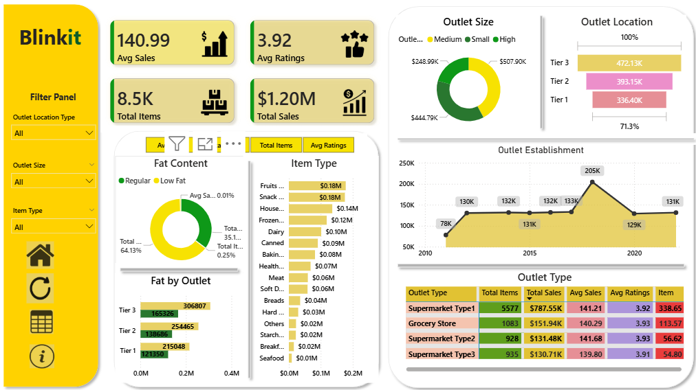
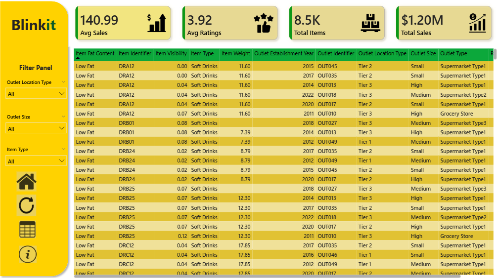

# 🛒 Blinkit Sales Analysis Dashboard | Power BI

## 📌 Project Overview

The **Blinkit Sales Analysis Dashboard** is an interactive Power BI project designed to analyze grocery sales performance and provide meaningful business insights. The dashboard helps visualize key metrics such as total sales, average sales, customer ratings, outlet performance, product categories, and sales trends through dynamic charts and KPIs.

This project demonstrates how Power BI can be used to transform raw data into actionable insights for business decision-making.

---

## 📊 Dashboard Features

- 📈 Total Sales KPI
- 💰 Average Sales Analysis
- ⭐ Average Customer Ratings
- 📦 Total Items Sold
- 🏪 Outlet Size Distribution
- 📍 Outlet Location Analysis
- 📅 Outlet Establishment Trend
- 🥛 Fat Content Analysis
- 🛍️ Item Type Performance
- 🏬 Outlet Type Comparison
- 🎛️ Interactive Filters for:
  - Outlet Location
  - Outlet Size
  - Item Type

---

## 📷 Dashboard Screenshots

### Dashboard Overview



### Data Table View



---

## 📈 Key Insights

- **Total Sales:** **$1.20M**
- **Average Sales:** **140.99**
- **Average Customer Rating:** **3.92**
- **Total Items:** **8.5K**

### Business Insights

- Tier 3 outlets generate the highest sales compared to other locations.
- Medium-sized outlets contribute significantly to overall revenue.
- Low Fat products account for a major portion of total sales.
- Fruits, Snacks, and Household products are among the top-performing categories.
- Supermarket Type 1 records the highest total sales among all outlet types.
- Outlet establishment trends show consistent growth over the years.

---

## 🛠️ Tools & Technologies Used

- Power BI Desktop
- Microsoft Excel
- Power Query
- DAX (Data Analysis Expressions)
- Data Cleaning & Transformation
- Data Visualization

---

## 📂 Project Structure

```
Blinkit-Sales-Analysis/
│
├── Dashboard/
│   └── BlinkIT_Sales_Dashboard.pbix
│
├── Data/
│   └── BlinkIT_Grocery_Data.xlsx
│
├── Images/
│   ├── Dashboard_Overview.png
│   └── Dashboard_Table_View.png
│
├── README.md
└── LICENSE
```

---

## 🎯 Project Objectives

- Analyze overall sales performance.
- Compare sales across different outlet sizes and locations.
- Identify top-performing product categories.
- Evaluate customer ratings and item distribution.
- Track outlet establishment trends over time.
- Provide business insights through interactive visualizations.

---

## 📌 Dashboard Highlights

- Clean and interactive Power BI interface
- Dynamic filtering for better data exploration
- KPI cards for quick performance tracking
- Visual comparison of outlet types and sizes
- Trend analysis using line and donut charts
- Easy-to-understand business insights

---

## 👨‍💻 Author

**Bhagat Singh Lodha**

**Skills:** Power BI • Excel • SQL • Python • Data Analytics

---

